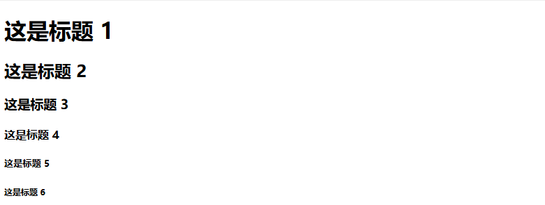
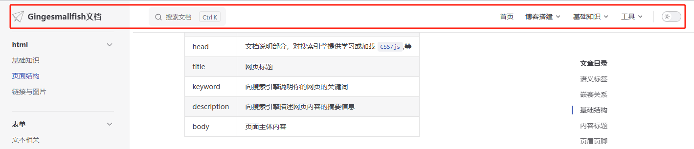
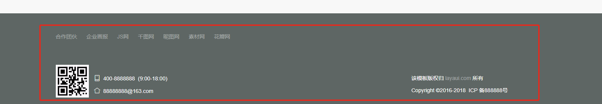
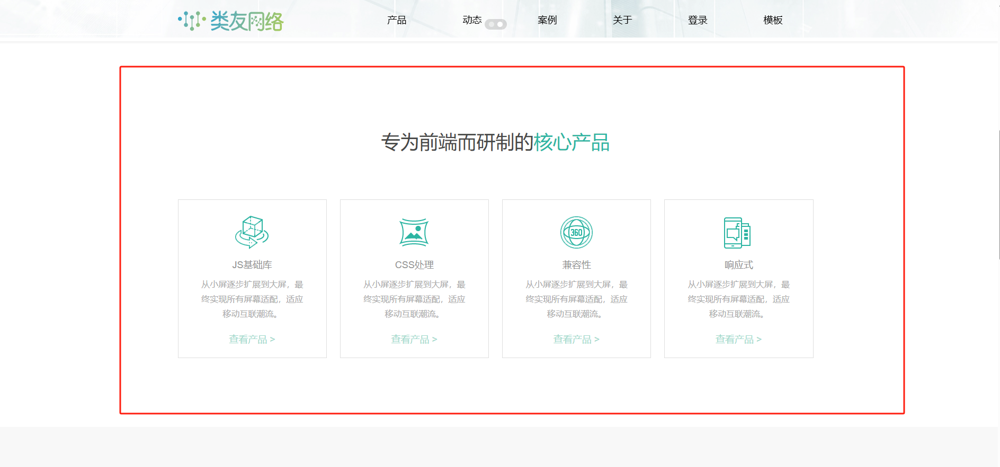

# 页面结构

## 语义标签

HTML标签有具体语义，非然技术上可以使用 `div` 标签表示大部分内容, 当选择清晰的语义标签
个容易让人看明白, 比如 `h1` 表示标题, `p` 标签表示内容，情调内容使用 `em` 标签

```html

<article>
    <h1>在先文档</h1>
    <p>在线文档平台</p>
</article>
```

## 嵌套关系

元素可以互相嵌套包裹，即元素存在父子级关系

```html

<acticle>
    <h1>在线文档</h1>
    <div>
        <p>在线文档平台</p>
        <span>Gingesmallfish</span>
    </div>
</acticle>
```

::: tip
图片是在网上找的，如果不清楚什么是 `嵌套关系`,
的可以自行查询资料[嵌套关系](https://blog.csdn.net/qq_42852004/article/details/90768237)
:::


## 基础结构

```html
<!doctype html>
<html lang="en">
<head>
    <meta charset="UTF-8">
    <meta name="viewport"
          content="width=device-width, user-scalable=no, initial-scale=1.0, maximum-scale=1.0, minimum-scale=1.0">
    <meta http-equiv="X-UA-Compatible" content="在线文档，关注科技最前沿技术">
    <title>在线文档</title>
</head>
<body>

</body>
</html>
```

| 标签          | 说明                             |
|-------------|--------------------------------|
| DOCTYPE     | 声明 `HTML` 文档                   |
| html        | lang: 网页的语言,如 `ex/zh`等， 非必选项目  |
| head        | 文档说明部分，对搜索引擎提供学习或加载 `CSS/js`,等 |
| title       | 网页标题                           |
| keyword     | 向搜索引擎说明你的网页的关键词                |
| description | 向搜索引擎描述网页内容的摘要信息               |
| body        | 页面主体内容                         |


## 内容标题
标题使用 `h1~h6` 来定义，用于突出显示文档内容

* 从 `h1` 到 `h6` 对搜索引擎来说权重会越来越来小
* 页面中最好只有一个 `h1` 标签
* 标题最好不要嵌套 `h1` 内部包含 `h2` 
* 下面是使用默认样式的标题效果，掌握 CSS 后我们就可以随意美化了。

```html
<h1>这是标题 1</h1>
<h2>这是标题 2</h2>
<h3>这是标题 3</h3>
<h4>这是标题 4</h4>
<h5>这是标题 5</h5>
<h6>这是标题 6</h6>
```


## 页眉页脚
### header 

header 标签用于定义文档的页眉，下图中红色区域都可以使用 `header` 标签构建



```html

<body>
<header>
    <nav>
        <ul>
            <li><a href="">首页</a></li>
            <li><a href="">工具</a></li>
        </ul>
    </nav>
</header>
...
</body>
```

### footer

footer 标签定义文档或节的页脚，页脚通常包含文档的作者、版权信息、使用条款链接、联系信息等等。



```html

<body>
...
<p class="footer-web">
    <a href="javascript:;">合作团伙</a>
    <a href="javascript:;">企业画报</a>
    <a href="javascript:;">JS网</a>
    <a href="javascript:;">千图网</a>
    <a href="javascript:;">昵图网</a>
    <a href="javascript:;">素材网</a>
    <a href="javascript:;">花瓣网</a>
</p>

<div class="layui-col-sm10 layui-col-lg11">
    <div class="layui-row">
        <div class="layui-col-sm6 layui-col-md8 layui-col-lg9">
            <p class="contact-top">
                <i class="layui-icon layui-icon-cellphone"></i>
                &nbsp;400-8888888&nbsp;&nbsp;(9:00-18:00)
            </p>
            <p class="contact-bottom">
                <i class="layui-icon layui-icon-home"></i>
                &nbsp;88888888@163.com
            </p>
        </div>
        <div class="layui-col-sm6 layui-col-md4 layui-col-lg3">
            <p class="contact-top">
							<span class="right">
								该模板版权归
								<a href="http://81.69.228.198/layui/www.layui.com/index.html"
                                   target="_blank">layaui.com</a>
								所有
							</span>
            </p>
            <p class="contact-bottom">
                <span class="right">Copyright&nbsp;&copy;2016-2018&nbsp;&nbsp;ICP&nbsp;备888888号</span>
            </p>
        </div>
    </div>
</body>
```

## 导航元素

在 HTML 使用 `nav` 设置导航链接


```html

<header>
    <nav>
        <ul>
            <li>
                <a href="">首页</a>
            </li>
            <li>
                <a href="">博客搭建</a>
            </li>
        </ul>
    </nav>
</header>
```

## 主要区域

HTML5 中使用 `main` 标签表示页面主要区域,一个页面 `main` 元素最好出现一次



```html

<body>
...
<main>
    <article>
        <h2>网站动态</h2>
        <ul>
            <li><a href="">完成签到 开心每一天</a></li>
            <li><a href="">完成签到 来了，老铁</a></li>
        </ul>
    </article>
</main>
...
</body>
```


